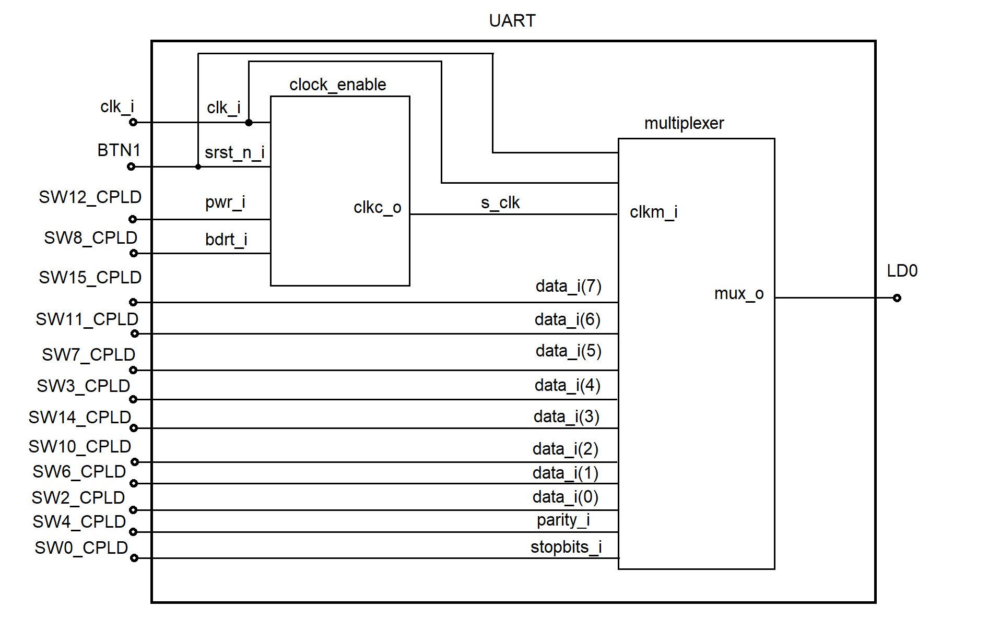

# Projekt - UART<h1>
&nbsp;
  
## Zadání<h2>
  Universal asynchronous reciever-transmitter tedy univerzální asynchronní přijímač-vysílač. Slouží k sériové komunikaci s možností změny parametru. Signál vysílá po slovech začínajících start bitem a dále pokračujícími datovými bity s hlavní informací, paritním bitem a stop bitem.   Datové bity jsou samotná informace, kterou chceme vysílat či přijímat.  Za úkol jsme dostali vytvořit pouze vysílač s možností nastavovaní parametrů vysílání.
&nbsp;

### Start bit a stop bit<h3>
Start bit a stop bit slouží k určení délky slova pro přijímač.
&nbsp;
  
### Datové bity<h3>
  Datové bity nesou hlavní informace zadané uživatelem. Ce. Jsou ovládáné přepínači na přídavné desce
&nbsp;
  
### Paritní bit<h3>
  Paritní bit slouží ke kontrole stavu datových bitů. Podle toho zda je lichá nebo sudá doplní do slova buď 1 nebo 0.
   Parametry které je možné měnit jsou dříve zmíněné části slova kromě stavu start a stop bitu. U stop bitu můžeme zvolit jsetli bude jeden nebo budou dva.
   
&nbsp;   
    Dále je možné tlačítkem vybrat si ze dvou standardních baud rate (bitrate) 9600 bps a 19200 bps, 0 je pomalější a 1 rychlejší baud rate . Paritu lze nastavit sudou nebo lichou tlačítkem, kde 0 je sudá a 1 lichá parita. Pro tento projekt je zvolena parita jedniček. Pravděpodobně nejjednodušším řešením jsou použité logické funkce xor.
&nbsp;

&nbsp;

Schéma  č. 1: Vnitřní zapojéní struktury a připojení na desky 
&nbsp;

&nbsp;

&nbsp;
Diagram č. 1: Časový diagram s binárními čísly 
&nbsp;

&nbsp;

&nbsp;

&nbsp;
Diagram č. 2: Časový diagram s hexadecimálními čísly 
&nbsp;

&nbsp;
## Zdroje:<h2>
* předchozí zadání

